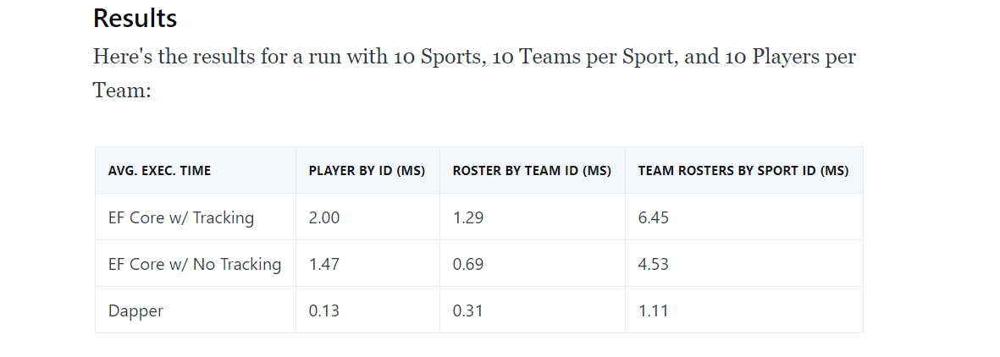

## Dapper vs Entity Framework

Let us start with the answer most people look for when making this question. Is Entity Framework really that bad? And the answer is complicated. When it comes to performance... 

Let's see what this <a href="https://exceptionnotfound.net/dapper-vs-entity-framework-core-query-performance-benchmarking-2019/">benchmark</a> has to say:

Essentially, dapper is by far the superior option in case of performance. However there is a lot more to software development than performance.

## Development speed and Flexibility

So let's talk about the other important things when it comes to choosing a method of accessing your DB. Development speed is important, but it's highly dependent on your team, if your team is familiarized with every caveat, that entity framework can give you both in development and in production, then EF might be the better option. 

However, take note that EF Core is different from EF 6 which is what most seasoned developers will have worked with in production environments. There are new caveats to EF that have to be taken into consideration, such as what actually happens when you use the "Include" function to make joins, when you should enable lazy loading and when you should keep it off, and how to deal with DB objects more basic than tables.

In the case of dapper, you don't need your team to be full of dapper experts, the learning curve is small and it's fairly easy to pick up with basic SQL and C# knowledge, some ADO.NET experience wouldn't hurt but is absolutely not mandatory.

Flexibility is one of the points I think dapper shines the most on. Integrating stored procedures into your flow is very easy, same with views. Such a thing is most definitely not impossible with Entity Framework, but it is harder and you (and your team) need a grasp of the framework to do this.

To make Dapper truly shine, it think it should be considered that you won't be using just dapper unless you want absolute control. To increase development speed you will have to give up some control, it is only natural. For that there are extensions which will be mentioned below.

## Dapper Extensions

Yes, dapper has extensions, 7 in fact, and they all do very similar things, some do more than others.

A first time user will have a tough time discerning which one is better to use and what they offer. Basic dapper is very easy, but lots of questions come when you want to do more advanced things with your micro-ORM. You may be using Postgres or MySQL rather than SQL Server, you may have an odd naming convention for your database objects. You may or may not have embraced some sort of database version control system such as migrations (be it Entity Framwork migrations or some other provider) or a tool to update your schema based on comparissons (like SSDT or Postgres Compare).

The extension that you choose to use will depend on your use case. I honestly like Dapper Contrib due it's simplicity and because it is the one made by the creators of dapper itself. But it might be insufficient when using anything that is not SQL Server if you want to customize the mapping between your entity classes and your database tables and fields.

You can find a link to further information for you to take your choice here: <a href="https://dapper-tutorial.net/third-party-library">https://dapper-tutorial.net/third-party-library</a>

## Code First vs Database First

A huge role in your choice between Entity Framework and Dapper is your preffered approach to database change management. Do you wish yo use Code First and lose control of the generated SQL? or do you wish to use a "Database First" kind of approach?

This is one of the biggest factors in decision making since here is where things split. Entity Framework Core doesn't really support database first. There are ways to force it, such as using scaffolding after every change to the database (or making changes in the DbContext class which is even worse), but these methods are cumbersome and very error prone.

I remember attempting to do this in a project where we used EF Core 3. I had just written a migration in raw SQL, but sadly it wasn't perfect. I ran the migration and then ran the scaffold command which caused around 100 compile errors. Normally I would just go back, change the migration, delete it from history and run it again, but because the scaffolding had brought many compile errors I could no longer run migrations, since my app was not compiling.

Experences like this tell me that the tooling of Entity Framework Core, while awesome in it's use case is not meant to support teams that want control of their SQL.

I had to either, stash all my changes OR change everything manually to have it compile, then change it back to how it was supposed to be.

It is possible to use a "Code First" approach with Dapper. You will need to use a library like FluentMigrator to make it work (since installing entity framework just for migrations is non-sense), but it can work without too much work.

## Takeaways and my opinion

This is a hard topic to talk about, because there is too much to talk about. I might write a follow-up post some other time comparing database change management approaches or a compared list of dapper extensions.

But for now I will leave my opinion. I think Dapper is the better option when you want control of your database. Paired up with SSDT in the case of SQL Server and Dapper Contrib or Dapper.SimpleCRUD it is one of the easiest ways of handling complex database heavy applications without losing control of my database or having to call my DBA to explain why he can't modify the database in any other way that is not through an entity framework migration.

