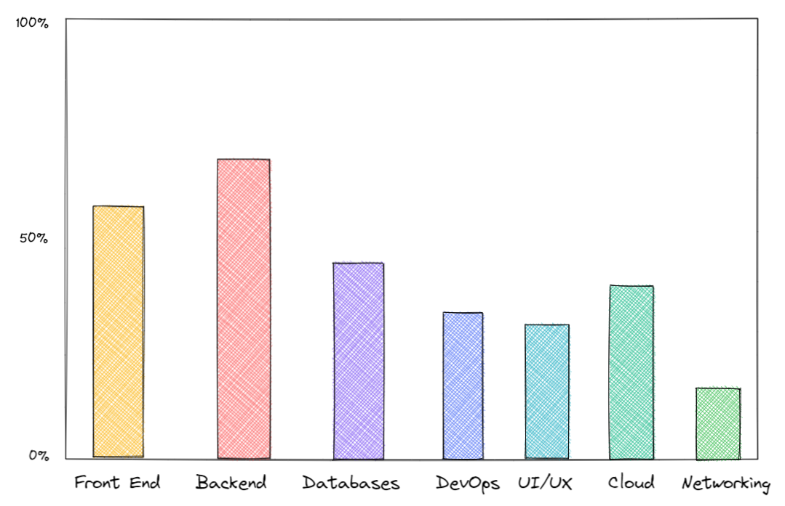
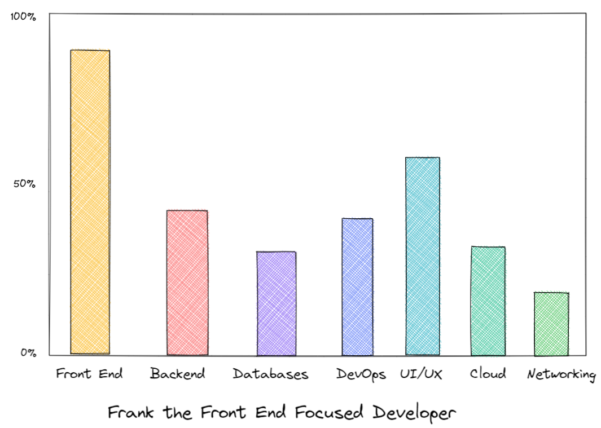
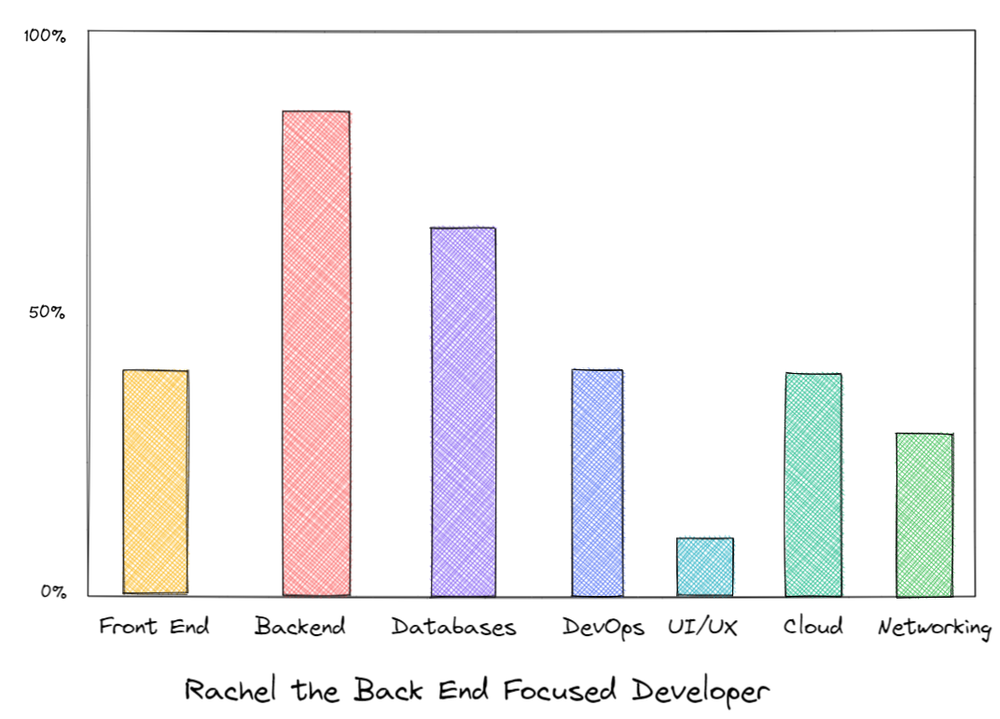
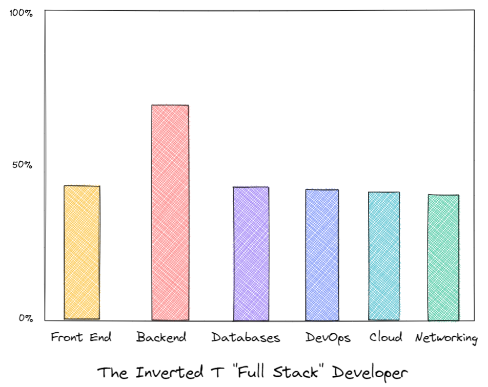

For a very long time I have considered myself a full stack developer. I still consider myself a full stack developer. But I have to recognize, that it is a loaded term, and it means different things to different people.

For that reason, it's no surprise that there's a lot of career advice when it comes to helping entry level or junior developers to get to higher positions. Some will recommend full stack development, others won't and will instead say to avoid the trap of being a jack of all trades, master of none.

However, it would be naive to say that there will ever be a shortage for that role, even when different companies have different ideas of what a full stack dev is.

Today I want to expand the term a little further, explain what it means for me and how a different approach on defining it can help anyone achieve the right focus for their web dev career.

## What does full stack development mean?

The most common definition for this is Back End + Front End. A developer that knows how to write Golang APIs and knows a bit of React can be considered a full stack developer.

While this is true, I have an issue with this way of looking at things. Because it makes for inaccurate decisions on both the developer choosing a career path and the company looking to hire the best fit.

## Not all developers are created equal

I know some developers that are amazing at styling and turning a mockup into reality, but can't get an API running without googling first every step to do so. I know also developers that can write APIs easily, secure them and write a good database layer with their ORM of choice, but when pushed to creating the visual side of the CRUD end up stuck making a button have the right shape.

We all have different skills and preferences and we will naturally gravitate towards the areas in web development that synergize the most with those skills and preferences.

For some time I have mentioned in potential interviews or responding to recruiters that I am a full stack developer with an emphasys and preference on backend. As in another way of saying: 

"I can build you an API really fast, and I can also build you the screen that will consume a specific API call, but I'll be somewhat slower on the second part."

Recently though in a conversation with a dev in the team that I lead I came up with a better way to more clearly convey my boons and banes in the field.

## Skills required to launch a product

To build a successful software product you need some variable combination of all the following:

- Front End
- Back End
- Databases
- DevOps/Automation
- Cloud
- UI/UX
- Networking

Clearly different companies need different things. If your company product is an address verification API, your needs for front end will be few and far between except maybe for internal use portals.

If your company product is a tool for UI/UX, you will need a very powerful front end to manage all the things you can do on the app but maybe less backend focused developers since that is not where the business gets the most value.

If you're selling a cloud automation tool or even an Infrastructure as a Service platform like AWS, things like automation and networking take much more of an important role.

Because of this, even if you might not advertise yourself with a percentage value in all these areas, it is a good excersize to figure out where you are in each right now.

That will allow you to figure out which areas to focus on growing into the future based on the roles you're looking for.

My personal diagram looks something like this:

I will admit that the percentages are of course subjective, as it is very difficult to claim you will ever know 100% of all front end tech for example. But these are useful guidelines.

However, when using a diagram like this as a tool you can more easily see where you are and what you might want to focus on learning next based on your goals.

## Nuances

In my career I've noticed some correlations that exist between the different areas that are required for an app to be served to an end customer. Some areas are entwined. 

### Front End Focused

Let's use our imaginary developer Frank as an example:

Frank is a very experienced front end dev. You can see that by looking at how high his front end "stat" is. Inherently this comes with an interesting discovery, even though Frank is not a UX designer, nor has he ever held the position, he knows enough about it to not be horribly ignorant.

This is by virtue of a lot of experience turning all kinds of mockups, both good and bad into real screens users can click on. As a result of this experience, Frank will have learned enough about UI/UX by osmosis to not be ignorant about it at all. Bonus points if he's studied to topic in hopes of becoming an even better front end dev.

In other words, the nature of front end will push you to learn more about how UI/UX works the higher you go. The same to some degree with DevOps, since a Senior Front End Engineer will likely at some point learn about the cloud solutions and automation tools that his specialization requires. While this particular developer doesn't need to know a lot of back end, he knows enough for his role.

### Back End Focused

Let us now use Rachel as a different example:

Rachel is a very experienced back end dev. A back end dev with a lot of experience will inevitable have good knowledge about databases, since he or she will have worked with multiple providers. Also, a good backend focused developer such as Rachel will have some level of knowledge of networking, protocols and perhaps lower level concepts that aid in implementing complex scenarios.

Rachel might know a bit of React or Angular, but it's not where she excels at. She can support an existing front end team if she's got some free time, but with her skillset it'd be dumb for her company to not use her where she already excels. In this case, we find that a high level back end focused developer will also know enough about databases and some networking and cloud. The reason for this is simple, as a backend focused dev, you'll know at least about the existence of GraphQL, Websockets, WebRTC gRPC and/or RTMP You'll also likely have worked with both SQL _and_ No-SQL databases.

### An inverted T shaped developer

For this scenario, I won't add a name, because such a person with a perfect looking graph might not exist. But the concept is useful nonetheless. For the sake of making it more realistic, I've removed UI/UX as a dimension from the graph.

What I describe as an inverted T shaped developer is something that looks like this:

The idea with this one is to exemplify what a company might think of when hiring a full stack developer. It's not about being a jack of all trades, master of none. The value in a full stack developer, or an "inverted T-shaped" Full Stack developer is in having someone that can understand to some degree the entire ecosystem, but excels in one thing.

This allows for flexibility in moving accross the organization and sharing and gaining knowledge, but also makes it clear what the "default" job of that one specific developer should be under normal circumstances.

## Caveats

Some areas might be irrelevant depending on your specialization or area of focus. A front end focused person might need to care little for low level networking. A backend focused person doesn't neet much in the way of UI/UX. A DevOps and cloud architect might need less front end than someone else. There can be more or less areas depending how many years your career has spanned or which area you are more skilled at.

The point here is to show a series of examples that can help plan your career better and choosing what to learn.

This set of recommendations is not easy nor fast, it takes discipline and time. However, [your technical career doesn't need to be short](https://lethain.com/forty-year-career/). It's certainly the path I have chosen to take and one that might help me later should I decide to switch into product management or tech management in general, where being a generalist matters more.

## Summary

This is just a small insight of the nuances of what it means to be a full stack dev.

My main takeaway is that if you're starting your career and want to be a full stack developer, don't become a mediocre full stack dev. Instead, pick one thing you're good at, train it and grow it, let that become your specialty. At the same time, during off times, try to get experience out of your main field of expertise to keep other abilities leveled to an acceptable level. 

If you do this, you'll be a well rounded developer that will find it easy to fit into varied roles. You'll be the kind of dev that can work on a specialized title, like "Senior Backend Developer" in a company that labels it that way and also be in a company that seeks more flexibility from their employees and likes them to know different aspects of their stack. 

Either way, for a management shift you will need some generalist experience if you want to excel. But that's a topic for another post.
